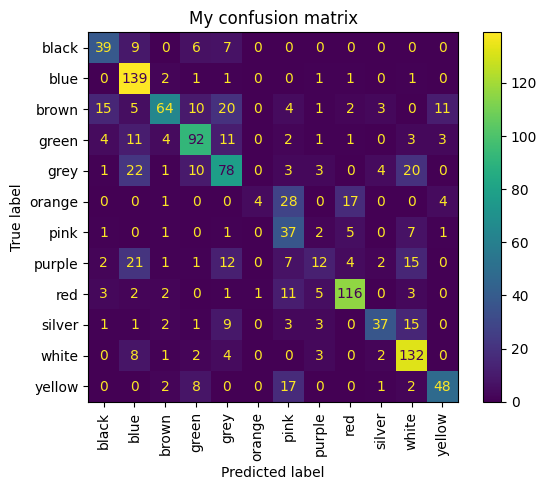
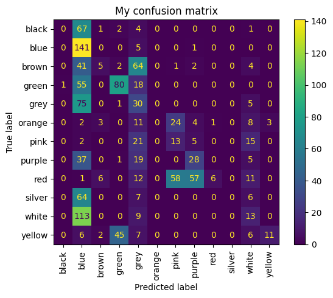
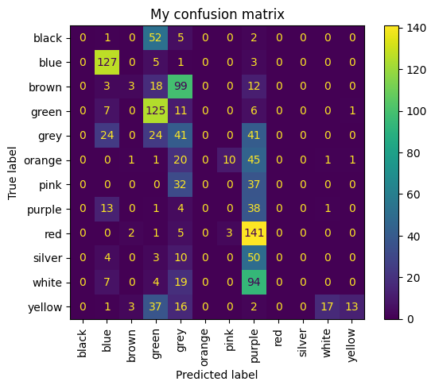
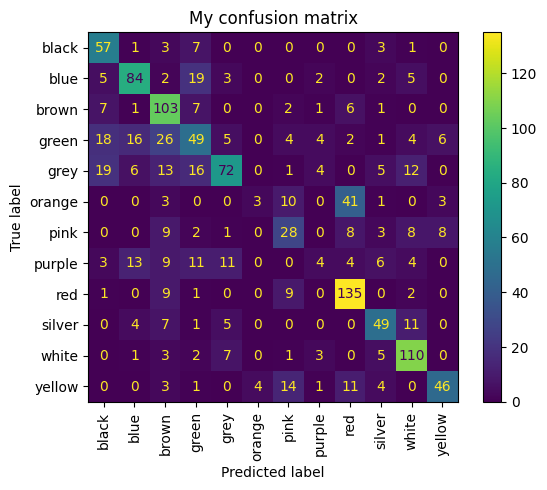
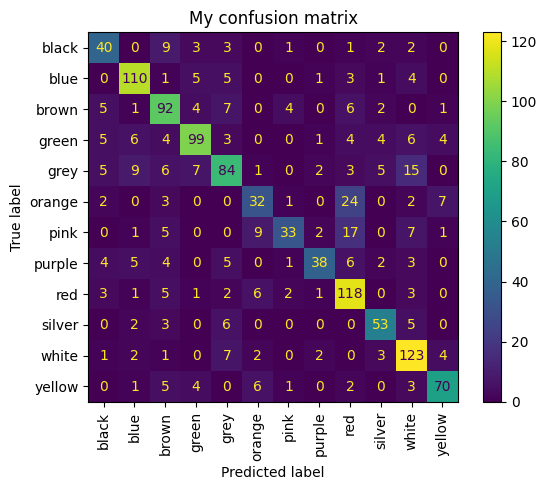

# Лабораторные работы по "Современным нейросетевым технологиям"
Все лабораторные представленные в виде блокнотов с соответствующими названиями.
Датасет хранится в папке data.

Датасет: 6000+ Store Items Images Classified By Color. Состоит из набора разных вещей и одежды. 12 классов.

Ссылка на датасет: https://www.kaggle.com/datasets/imoore/6000-store-items-images-classified-by-color

## Lab2. Полносвязная свёрточная сеть

Была реализована полносвязная модель из 5 слоёв Linear, в качестве функции активации выбран relu.

Получены результаты: loss = 1.1114482879638672, samples = 384, accuracy 0.6314102564102564

## Lab3. Свёрточная сеть с метриками

Была реализована модель из 6 слоёв Conv2d и 2 Linear, также 3 слоя с MaxPool2d, в качестве функции активации выбран relu.
Получены результаты: loss = 1.0774588584899902, samples = 384, accuracy 0.6394230769230769

Также были добавлены метрики:

|Метрика  |Значение|
| ------- | ------:|
|Accuracy | 63.94% |
|Precision| 64.27% |
|Recall   | 58.48% |

И матрица ошибок:



## Lab4. Улучшение показателей метрик свёрточной сети

Тесты с разными аугментациями:

### 1 тест. Только аугментации

Параметры аугментаций:

```python
    A.Flip(p=0.3),
    A.ElasticTransform(alpha=1.15, sigma=50, alpha_affine=10),
    A.RandomBrightnessContrast(p=0.4),
    A.Blur(blur_limit=3),
    A.Normalize(
        mean=[0.485, 0.456, 0.406], 
        std=[0.229, 0.224, 0.225], 
    ),
    ToTensorV2()
```

  Результаты ухудшились.
  loss = 0.8410181403160095, samples = 384 accuracy 0.2620192307692308

|Метрика  |Значение|
| ------- | ------:|
|Accuracy | 26.20% |
|Precision| 29.38% |
|Recall   | 21.78% |

  

### 2 тест. Только аугментации

Параметры аугментаций:

```python
    A.Flip(p=0.3),
    A.Blur(blur_limit=3),
    A.Normalize(
        mean=[0.485, 0.456, 0.406],
        std=[0.229, 0.224, 0.225],
    ),
    ToTensorV2()
```
Показатели всё также хуже изначальных.
loss = 0.8668563365936279, samples = 384, accuracy 0.2780448717948718

|Метрика  |Значение|
| ------- | ------:|
|Accuracy | 27.80% |
|Precision| 21.47% |
|Recall   | 24.31% |



### 3 тест. Изменение архитектуры

Теперь поменяем архитектуру, добавив CSP block.

Изначальный вид:

```python
    def forward(self, x):
        x = self.conv_1(x)
        x = F.relu(x)
        x = self.conv_2(x)
        x = F.relu(x)
        x = self.pool(x)
        
        x = self.conv_3(x)
        x = F.relu(x)
        x = self.conv_4(x)
        x = F.relu(x)
        x = self.pool(x)
        
        x = self.conv_5(x)
        x = F.relu(x)
        x = self.conv_6(x)
        x = F.relu(x)
        x = self.pool(x)

        x = torch.flatten(x, start_dim=1)
        
        x = self.linear_1(x)
        x = F.relu(x)
        x = self.linear_2(x)
        
        return x
```

Теперь forvard выглядит следующим образом (для наглядности выделил CSP пустыми строками):

```python
    def forward(self, x):
        x = self.conv_1(x)
        x = F.relu(x)

        x = self.csp_1(x)

        x = self.conv_2(x)
        x = F.relu(x)
        x = self.pool(x)
        x = self.conv_3(x)
        x = F.relu(x)

       x = self.csp_2(x)

        x = self.conv_4(x)
        x = F.relu(x)
        x = self.pool(x)
        x = self.conv_5(x)
        x = F.relu(x)

        x = self.csp_3(x)

        x = self.conv_6(x)
        x = F.relu(x)
        x = self.pool(x)

        x = torch.flatten(x, start_dim=1)
        
        x = self.linear_1(x)
        x = F.relu(x)
        x = self.linear_2(x)

        return x
```

Для чистоты эксперимента, уберём аугментации.Получились такие результаты:
loss = 0.9860660433769226, samples = 384, accuracy 0.592948717948718
|Метрика  |Значение|
| ------- | ------:|
|Accuracy | 59.29% |
|Precision| 54.85% |
|Recall   | 54.50% |



По результатам тестов можно сказать, что аугментации и csp block для данного датасета не показали успешного результата, лишь увеличивали вычислительную сложность. Csp block был наиболее успешным, но и он не смог достичь той же точности, что и на начальных условиях. Вероятно, на большем количестве эпох результат будет другим.

## Lab5. Свёрточная сеть на ResNet

Была дообучена модель ResNet-18.

После обучения мы получили следующие результаты
loss = 0.8098057508468628, samples = 384, accuracy 0.7147435897435898
|Метрика  |Значение|
| ------- | ------:|
|Accuracy | 71.47% |
|Precision| 71.77% |
|Recall   | 68.79% |


